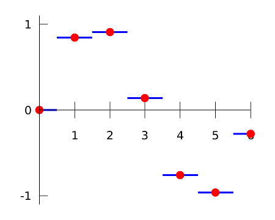
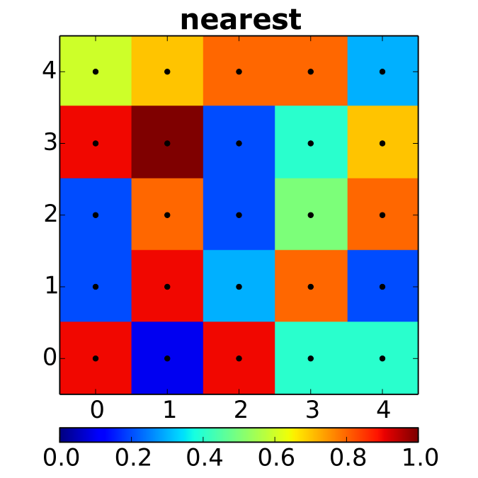
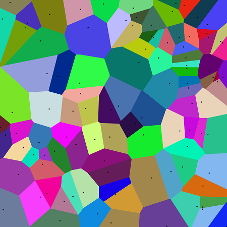
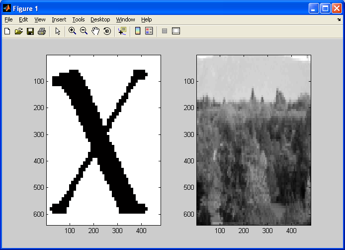
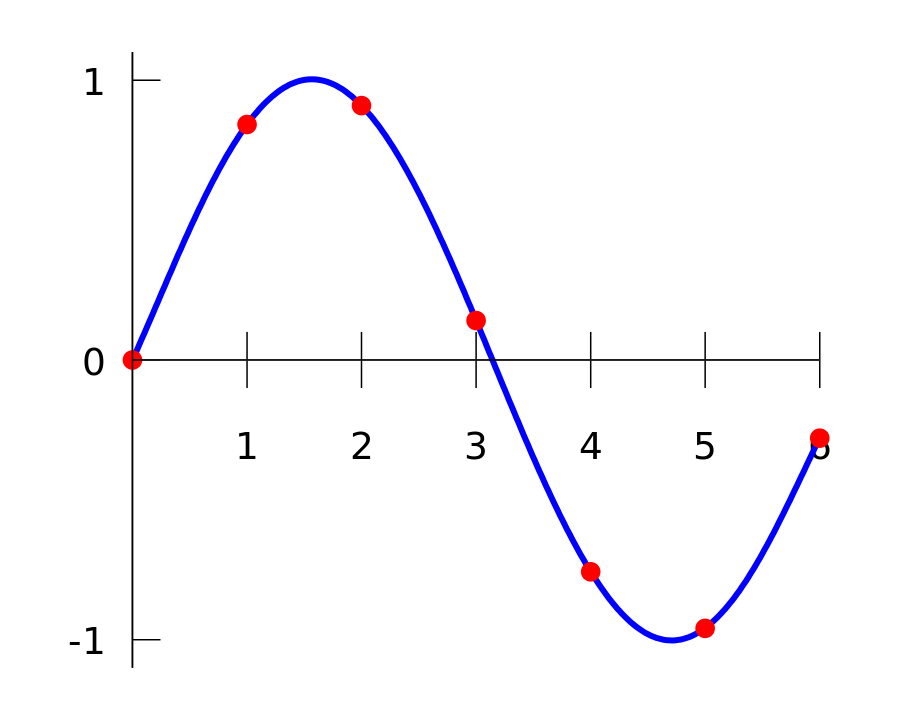
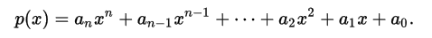
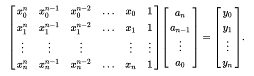
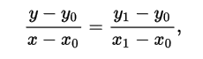
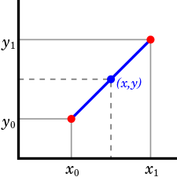
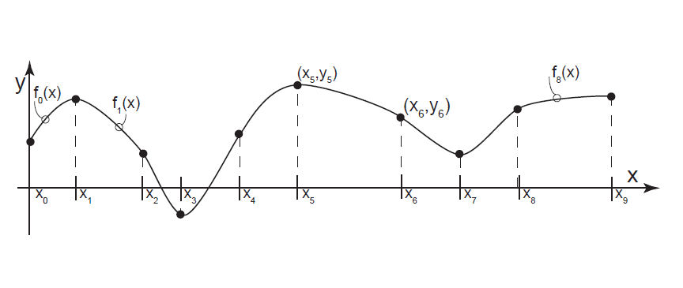

## What is Interpolation?

Many times, especially in engineering and science, data is given only at discrete points and it is often required to estimate data points in-between the given discrete data points. The method to estimate or construct these new data points is called **interpolation**. **Interpolation** derives a function from a set of discrete data points that passes through all the given data points. The function derived from interpolation depends on the interpolation methods used. 

In addition to estimate data points, interpolation is also used to approximate a complicated function by a simple function. The simple function can be obtained by making an interpolation from a few data points evaluated from the original function. Although this simple function have interpolation errors, depending on the problem domain and the interpolation method used, the gain in simplicity may be better than the loss in precision from errors.

There are a lot of interpolation methods that can be used to estimate data points. When choosing an appropiate interpolation method for a problem, there are some things that need to be considered, like how accurate is the method, how expensive (complex) is it, how smooth is the interpolant, and how many data points are needed. In this article, the interpolation methods that will be discussed are the commonly used ones because of its simplicity, they are:
- [Nearest-Neighbour Interpolation](#nearest-neighbour-interpolation)
- [Polynomial Interpolation](#polynomial-interpolation)
- [Linear Interpolation](#linear-interpolation)
- [Spline Interpolation](#spline-interpolation)

## Nearest-Neighbour Interpolation

**Nearest-neighbour interpolation** (also known as **proximal interpolation**) is the simplest interpolation method. Rather than calculate an average value by some criteria or generate value based on complicated rules, this method locates/selects the value of the nearest data point and assign that value. Because this method only considers the nearest point it is also called **piecewise constant interpolation**. 

Although this method is unlikely to be used in simple problems because there are other methods that are almost as simple to implement but overall better than this method, this method is a favourable choice over the other methods in high-dimensional multivariate interpolation (interpolation in functions that contain more than one variable) because of its speed and simplicity. This method is commonly used in real-time 3D rendering to select color values for a textured surface. 

|  |  |  |
| --- | --- | --- |
| Nearest-neighbour interpolation (blue lines) in one dimension. [1] | Nearest neighbor interpolation on a uniform 2D grid (black points). [1] | Nearest neighbor interpolation of a random set of points (black dots) in 2D. [1] |

Another application of this method is to scale up an image in image processing. But there is a major drawback in using this method for image processing. It tends to generate images of poor quality.

|  |  |  |
| --- | --- | --- |
| Small image of an 'X'. [2] | Small image of trees. [2] | Upscaled images of an 'X' and trees. [2] |

## Polynomial Interpolation

**Polynomial interpolation** is an interpolation method that estimates values in-between known data points by finding a polynomial function that goes through known data points. For a set of _n + 1_ known points (_xi, yi_) where no two _xi_ are the same, there exists one polynomial function of degree _n_ or lower that passes through all the known points. Polynomial interpolation is commonly used for interpolation because polynomials are easy to evaluate, differentiate, and integrate relative to other choices such as trigonometric and exponential series.

|  |
| --- |
| Polynomial interpolation (blue curves). [3] |

There are several ways/methods to construct polynomial interpolation from a given set of data points. The simplest method is the direct method that construct the polynomial interpolation by solving the system of linear equations created from the given set of data points. It is not necessary to use all the given data points. The data points that are used to create the interpolation are data points that are closest to the value that is going to be estimated and the number of chosen data points is based on the order of the polynomial used to interpolates the given data points.

Suppose there are _n + 1_ data points and these data points are going to be interpolated by polynomial of degree _n_. The polynomial interpolation is in the form

By substituting the given data points into the equation, we will get a system of linear equations that can be represented as a matrix-vector form

By solving this system for _ak_, we will get the interpolant (polynomial function) that goes through all the given point. One of the method that can be used to solve this system of equations is Gaussian elimination.

Other than the direct method, methods that are commonly used to construct polynomial interpolation are Newton's divided difference polynomial method (Newton form) and the Langrangian interpolation method. These two methods are better than the direct method in terms of calculation speed and complexity of the calculation.

The application of polynomial interpolation is to approximate complicated curves, for example, the shapes of letters in typography, evaluate natural logarithm, or evalute trigonometric functions. It is also used to perform sub-quadratic multiplication and squaring such as Karatsuba multiplication and Toom-Cook multiplication because it has a faster computation time. 

But, there is a problem in using polynomial interpolation. The problem is that the resulting graph might not reflect the actual problem. It is possible that the polynomial function, although accurate at the given points, will differ from the true values at some regions between the given data points when there are "spikes" in the graph, reflecting the unexpected events in a real-world situation. Other problem is the Runge's phenomenon that shows for high values of _n_ (degree), the polynomial interpolation may oscillate wildy between the given data points.

## Linear Interpolation

**Linear interpolation** is a special case of polynomial interpolation when the interpolation constructed is a polynomial of degree 1 (linear polynomial). To construct linear interpolation, we solve this equation

using the given data points (only uses two data points). Interpolating a set of data points using linear interpolation can be done by concatenating the linear interpolant between each pair of data points. Linear interpolation is most accurate when the given pair of data points are close to one another in value, and when the correlation between _x_ and _y_ is approximately linear.

|  |
| --- |
| Linear interpolation (blue line) between two points. [7] |

Linear interpolation is often used to approximate a value of a function using two known values of that function at other data points. Linear interpolation is also often used to fill the gaps in a table, for example in statistics table, like chi-squared table, or t-distribution table where not all values for a given parameters are available in the table. By using linear interpolation, we can estimate the value that is not in the table in an easy way. Linear interpolation is commonly used in computer graphics, too. In computer graphics, linear interpolation is often called a **lerp**.

## Spline Interpolation

**Spline interpolation** is an interpolation method where the interpolant is a piecewise polynomial called a spline. Spline function consists of polynomial pieces on subintervals joined together with certain continuity conditions. Suppose a spline function _S_  of degree _k_ having data points (knots) _x0 , x1 , ... , xn_ then these conditions must apply to _S_.
- On each interval [_xi-1, xi_], _S(x)_ is a polynomial of degree at most _k_.
- _S(x)_ has continuous _(k-1)_ derivative on [_x0 , xn_]. 

|  |
| --- |
| Spline interpolation (cubic splines). [8] |

To construct the spline interpolation of given data points, first, we decide the degree of the polynomial that is going to be used to interpolate the data points. After that, for every pairs of interval in the given data points, solve the polynomial equation that goes through those data points. Solving the equation can be done by making a system of equations consists of the polynomial equations and the condition that must be applied to the derivative of the polynomial equation (must be continuous) using the given data points. 

Spline interpolation is often preffered to polynomial interpolation because its result is similar to polynomial interpolation with high degree while avoiding the problem of Runge's phenomenon where oscillation can occur between points when interpolating using high degree polynomials. Spline interpolation is often used in computer graphics because of the simplicity of its construction, accuracy of evaluation, and its capacity to approximate complex shapes through curve fitting. The most commonly used spline is cubic spline (spline of degree 3) because of the smoothness of the curve that it creates.

## References
[1] https://en.wikipedia.org/w/index.php?title=Nearest-neighbor_interpolation. Accessed on 25th May 2017, 15.00 WIB.  
[2] https://www.giassa.net/?page_id=207. Accessed on 25th May 2017, 15.30 WIB.  
[3] https://en.wikipedia.org/wiki/Polynomial_interpolation. Accessed on 25th May 2017, 17.30 WIB.  
[4] http://whatis.techtarget.com/definition/polynomial-interpolation. Accessed on 25th May 2017, 17.35 WIB.  
[5] w3.gazi.edu.tr/~balbasi/mws_gen_inp_txt_direct.pdf. Accessed on 25th May 2017, 17.50 WIB.  
[6] http://www.et.byu.edu/~rowley/ChEn273/Topics/Stream_Variables/Manipulating_Stream_Variables/Interpolation_Unknown_Model.htm. Accessed on 25th May 2017, 19.00 WIB.  
[7] https://en.wikipedia.org/wiki/Linear_interpolation. Accessed on 26th May 2017, 08.00 WIB.  
[8] http://www.cs.clemson.edu/~dhouse/courses/405/notes/splines.pdf. Accessed on 26th May 2017, 11.00 WIB.
